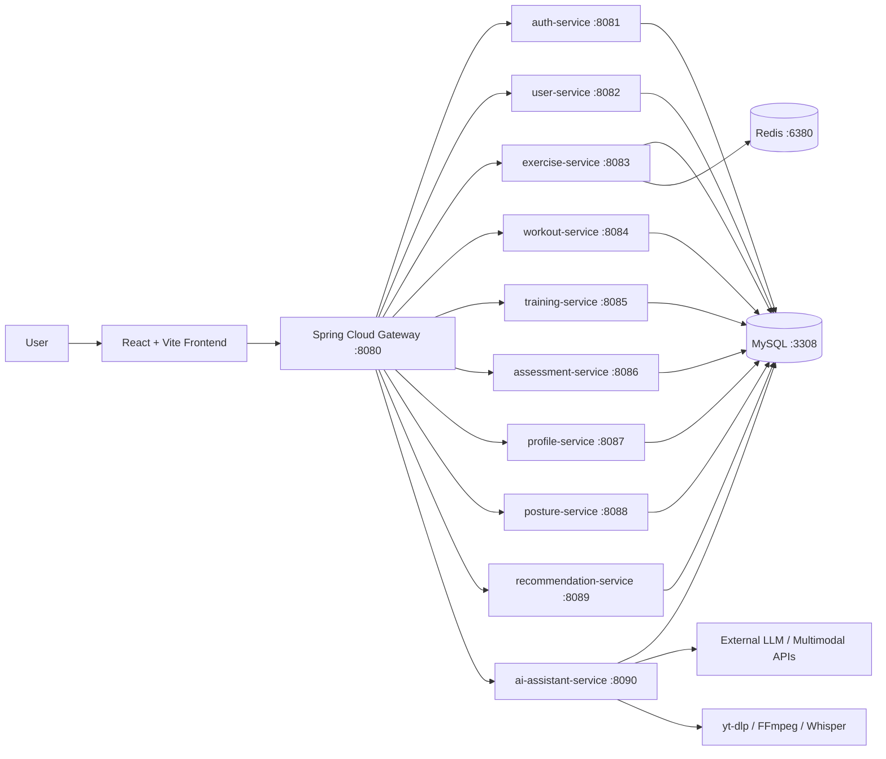

# SomaticBuilding

[中文说明](README.zh-CN.md) | [English](README.md)

SomaticBuilding is an AI-assisted somatic training and movement assessment system. It combines exercise-library management, posture and functional assessment, workout/module/course/program planning, training execution, athlete profile visualization, RAG-based coaching, and short-video-to-training-plan parsing in a full-stack React + Spring Boot microservice application.

本项目定位为面向身体功能训练、动作学习、训练编排和运动能力画像的一体化系统。系统不仅提供前端页面展示，还围绕真实数据库、后端接口、训练执行记录、动作库数据、AI 训练方案生成、短视频解析、RAG 知识问答、压测和自动化测试建立了完整工程闭环。

## 1. Project Highlights

- Full-stack implementation: React/Vite frontend + Spring Boot/Spring Cloud backend services.
- Exercise library: system-based library navigation, style filtering, exercise detail pages, custom exercise creation, image/video media support, and database-backed queries.
- Training builder: quick modules, full courses, weekly programs, drag-and-drop program planning, block/group/item parameters, template save/apply, and short-link sharing.
- Training execution: planned workout and actual execution are separated; workout player records real set/timer/exercise logs and summary data.
- Assessment and profile: system onboarding, goal input, movement/functional assessment, posture module, athlete profile, ability trends, goal radar and recommendation visualization.
- AI coach: separated Plan and Q&A modes; structured plan payloads for visual option cards; RAG knowledge retrieval for professional coaching answers.
- Short-video parsing: supports URL-based content extraction, subtitle/audio/frame analysis pipeline, movement candidate review, and plan generation from parsed video content.
- Data engineering: MySQL schema scripts, exercise data import/backfill scripts, Redis cache optimization, and performance reports.
- Quality evidence: frontend unit tests, backend unit/integration tests, build verification, and k6 load-test reports.

## 2. Core User Flows

### 2.1 System Onboarding and Assessment

1. User enters the system flow.
2. Login or registration is completed through backend auth APIs.
3. User fills baseline lifestyle, movement/injury history, equipment, level and goals.
4. Goal synthesis can call AI to produce structured summaries, recommendation signals and radar data.
5. Functional assessment and posture assessment produce ability/profile data.
6. Profile page visualizes current status, goal profile and training recommendations.

Related frontend routes:

- `/system`
- `/system/login`
- `/system/onboarding`
- `/system/goals`
- `/system/assessment`
- `/system/assessment-list`
- `/system/assessment-active`
- `/system/profile`
- `/system/history`
- `/system/summary`

### 2.2 Exercise Library

1. AppShell entry opens `/systems` and lets the user select an exercise system/style.
2. `/library/:systemId` shows exercises belonging to the selected system.
3. Training builder can open the library in a simplified selection mode with style filters.
4. Exercise detail pages show ability profile, target muscles, execution steps, cautions and media.
5. Users can add custom exercises and upload local cover/video media.

Related frontend routes:

- `/systems`
- `/library`
- `/library/:systemId`
- `/exercise/:id`

### 2.3 Training Modules, Courses and Programs

The training domain is split into three levels:

- Module: a quick training block, usually focused on one ability, joint function or short training purpose.
- Course: a complete single-session training class with multiple blocks and detailed parameters.
- Program: a weekly plan template that arranges modules/courses by Day 1, Day 2, etc.; actual calendar dates are attached only when the program starts.

Main capabilities:

- Quick module CRUD.
- Course builder CRUD.
- Program planner with day cards and draggable module/course templates.
- Scientific block structure based on training style and user intent.
- Save/apply templates.
- Share module/course templates with Base62 short links.
- TrainingHub reminder and continuity display for active program/day status.

Related frontend routes:

- `/training`
- `/modules`
- `/module/:id`
- `/workout-style`
- `/workout-builder`
- `/templates`
- `/programs`
- `/share/template/:shareCode`
- `/s/:shareCode`

### 2.4 Training Execution and Summary

1. A module or course is selected as a training plan.
2. Workout player starts a real training run.
3. Set, timer and exercise events are recorded as execution data.
4. Summary page calculates statistics from actual execution logs instead of only reading planned values.
5. Training history and profile charts consume backend statistics.

Related frontend routes:

- `/workout`
- `/workout-summary`
- `/athlete`

### 2.5 Posture and Joint Function Module

The posture module provides a visual body map, risk-joint markers, selected joint detail panels and joint-specific scan images. It is designed for mobile and desktop layouts.

Related frontend route:

- `/posture`

## 3. AI Capabilities

### 3.1 Plan Mode: Structured Training Design

The AI Plan entry is used for training design. It does not simply return free text; it attempts to guide the user through structured stages:

- Identify whether the user needs a quick module or a full course.
- Ask for missing constraints such as equipment, venue, duration and frequency.
- Infer training style from user intent, for example strength, hypertrophy, functional stability, mobility, conditioning or rehab.
- Generate visual A/B/C options for natural-language requests.
- Generate a single plan for external short-video links, because link parsing should reproduce the video content rather than invent three unrelated plans.
- Allow user refinements and regenerate structured plan payloads.
- Write confirmed plans into the module/course builder.

Implementation style:

- The current implementation uses a stable structured JSON protocol, embedded in assistant responses, to simulate function-calling style frontend/backend coordination.
- The frontend renders plan-scope, plan-intake and plan-options payloads as visual cards and buttons.

Key files:

- `backend/ai-assistant-service/src/main/java/com/somaticbuilding/aiassistant/application/AiAssistantService.java`
- `backend/ai-assistant-service/src/main/java/com/somaticbuilding/aiassistant/application/ExerciseAutoProvisionService.java`
- `src/shared/api/assistant.ts`
- `src/shared/components/AppShell.tsx`

### 3.2 Q&A Mode: RAG Coaching Assistant

The Q&A entry is separated from Plan mode. It is used for professional training knowledge questions rather than direct plan generation.

Current RAG capabilities:

- Loads local classpath knowledge files from `rag-kb`.
- Supports an external `knowledge-base` directory for future expansion.
- Retrieves relevant chunks and injects them into the model prompt.
- Provides fallback answers when model invocation is unavailable.
- Keeps Plan and Q&A responsibilities separate to avoid mixing training generation with general knowledge answers.

Key files:

- `backend/ai-assistant-service/src/main/java/com/somaticbuilding/aiassistant/application/RagKnowledgeService.java`
- `backend/ai-assistant-service/src/main/resources/rag-kb/`

### 3.3 Short-Video Link Parsing

The content-analysis pipeline is used to turn external video links into training plans or movement candidates.

Supported pipeline design:

- URL job creation.
- `yt-dlp` based content extraction.
- Subtitle and metadata extraction when available.
- Audio extraction and ASR through Whisper/Docker mode.
- Frame extraction through FFmpeg/FFprobe.
- Visual analysis through multimodal model endpoint when configured.
- Movement candidate extraction and review.
- Auto-provisioning for exercises not found in the existing exercise library.
- Plan draft generation from parsed content.

Key files:

- `backend/ai-assistant-service/src/main/java/com/somaticbuilding/aiassistant/application/ContentAnalysisService.java`
- `backend/ai-assistant-service/src/main/java/com/somaticbuilding/aiassistant/application/VideoLinkAutoExtractor.java`
- `backend/ai-assistant-service/src/main/java/com/somaticbuilding/aiassistant/application/VideoFrameExtractionService.java`
- `backend/ai-assistant-service/src/main/java/com/somaticbuilding/aiassistant/application/VideoVisualAnalysisService.java`
- `backend/ai-assistant-service/src/main/java/com/somaticbuilding/aiassistant/interfaces/ContentAnalysisController.java`

## 4. Architecture



## 5. Technology Stack

### Frontend

- React 18
- TypeScript / TSX
- Vite 6
- React Router
- Tailwind CSS
- Radix UI based component primitives
- Material UI icons/components where needed
- Three.js / React Three Fiber / Drei
- D3 and Recharts for visual data presentation
- React DnD for builder and program planning interactions
- Vitest for frontend unit tests

### Backend

- Java 17
- Spring Boot 3.2
- Spring Cloud 2023
- Spring Cloud Gateway
- Spring Cloud Alibaba dependency set
- MyBatis-Plus
- MySQL
- Redis
- Spring AI integration style
- JUnit 5 / Mockito / MockMvc for tests

### AI and Media Tooling

- OpenAI-compatible model endpoints
- DeepSeek-compatible model endpoint
- DashScope-compatible endpoint configuration
- yt-dlp
- FFmpeg / FFprobe
- Whisper ASR through Docker mode

### Engineering and Quality

- Git LFS for large 3D/body-model assets
- k6 load-test scripts and performance reports
- SQL indexes and Redis hotspot cache optimization evidence
- Frontend and backend automated tests

## 6. Backend Services

| Service | Port | Responsibility |
|---|---:|---|
| gateway-service | 8080 | API gateway and route aggregation |
| auth-service | 8081 | Login, registration and OAuth-related auth flow |
| user-service | 8082 | User profile/account data |
| exercise-service | 8083 | Exercise library, exercise media, filtering, cache |
| workout-service | 8084 | Module/course/template/program planning APIs |
| training-service | 8085 | Training run, execution logs, history and summaries |
| assessment-service | 8086 | Functional assessment sessions and results |
| profile-service | 8087 | Ability profile and athlete data aggregation |
| posture-service | 8088 | Posture snapshots and joint state data |
| recommendation-service | 8089 | Recommendation data for TrainingHub/Profile |
| ai-assistant-service | 8090 | AI plan, RAG Q&A, goal synthesis and video-link parsing |

## 7. Repository Structure

```text
D:/somaticBuilding
├── backend/                         # Spring Boot/Spring Cloud backend services
│   ├── gateway-service/
│   ├── auth-service/
│   ├── user-service/
│   ├── assessment-service/
│   ├── posture-service/
│   ├── exercise-service/
│   ├── workout-service/
│   ├── training-service/
│   ├── profile-service/
│   ├── recommendation-service/
│   ├── ai-assistant-service/
│   └── common-lib/
├── src/                             # React frontend source code
│   ├── app/                         # App entry and routes
│   ├── modules/                     # Feature modules: home/library/training/profile/system/posture
│   ├── shared/                      # API clients, shared components, data and utilities
│   └── styles/                      # Global CSS/Tailwind/theme files
├── public/                          # Static assets and body/exercise/posture media
├── scripts/                         # Data import, exercise media and performance helper scripts
├── docs/                            # API, architecture, database, PRD, testing and performance docs
├── guidelines/                      # Project guidelines
├── package.json                     # Frontend scripts and root test commands
├── pnpm-lock.yaml                   # Dependency lockfile
└── vite.config.ts                   # Vite configuration
```

## 8. Database Scripts

Database design and initialization files are stored under `docs/database`:

| File | Purpose |
|---|---|
| `docs/database/DB-INIT.sql` | Main database initialization script |
| `docs/database/DB-DDL-DRAFT.sql` | Core table DDL draft |
| `docs/database/DB-DDL-CONTENT-ANALYSIS.sql` | Content-analysis and video-link parsing related tables |
| `docs/database/migrations/2026-05-09-exercise-performance-indexes.sql` | Exercise-list performance indexes |

Default local database settings used by backend configs:

```text
MySQL host: localhost
MySQL port: 3308
Database: somaticbuilding_db
User: root
Password: ${MYSQL_PASSWORD:123456}

Redis host: localhost
Redis port: 6380
Password: ${REDIS_PASSWORD:123456}
```

## 9. Environment Configuration

A safe example file is provided:

```text
.env.example
```

Important variables:

```bash
MYSQL_HOST=127.0.0.1
MYSQL_PORT=3308
MYSQL_USER=root
MYSQL_PASSWORD=123456
MYSQL_DATABASE=somaticbuilding_db

REDIS_HOST=127.0.0.1
REDIS_PORT=6380
REDIS_PASSWORD=123456

OPENAI_API_KEY=
DEEPSEEK_API_KEY=

FFMPEG_COMMAND=ffmpeg
AUTO_VIDEO_DURATION_SEC=8
```

Real AI keys should not be committed to Git. For local development, use either system environment variables or an ignored private Spring config file:

```text
backend/ai-assistant-service/src/main/resources/application-local-private.yml
```

Example local private config:

```yaml
spring:
  ai:
    openai:
      api-key: your-openai-compatible-key
    deepseek:
      api-key: your-deepseek-key
```

This file is ignored by Git and is loaded automatically by `ai-assistant-service` when present.

## 10. Local Development

### 10.1 Prerequisites

- Node.js 18+
- pnpm through Corepack, or npm
- Java 17
- Maven 3.8+
- MySQL running on port `3308`
- Redis running on port `6380`
- Git LFS, because the repository contains large model/media assets
- Optional for short-video parsing: Docker, yt-dlp, FFmpeg, FFprobe

### 10.2 Install Frontend Dependencies

```bash
corepack enable
pnpm install
```

If using npm instead:

```bash
npm install
```

### 10.3 Initialize Database

Create database and import SQL scripts from `docs/database`. The main initialization file is:

```bash
docs/database/DB-INIT.sql
```

Additional DDL and migration files can be applied depending on the target feature set:

```bash
docs/database/DB-DDL-DRAFT.sql
docs/database/DB-DDL-CONTENT-ANALYSIS.sql
docs/database/migrations/2026-05-09-exercise-performance-indexes.sql
```

### 10.4 Start Backend Services

From the backend directory:

```bash
cd backend
mvn clean install -DskipTests
```

Run services as needed. Typical local startup order:

```bash
mvn -pl gateway-service spring-boot:run
mvn -pl auth-service spring-boot:run
mvn -pl user-service spring-boot:run
mvn -pl exercise-service spring-boot:run
mvn -pl workout-service spring-boot:run
mvn -pl training-service spring-boot:run
mvn -pl assessment-service spring-boot:run
mvn -pl profile-service spring-boot:run
mvn -pl posture-service spring-boot:run
mvn -pl recommendation-service spring-boot:run
mvn -pl ai-assistant-service spring-boot:run
```

For normal frontend testing, at minimum the gateway plus the services used by the current page should be running.

### 10.5 Start Frontend

From the project root:

```bash
npm run dev
```

Default Vite URL:

```text
http://localhost:5173
```

## 11. Data Import and Media Scripts

Useful scripts are stored under `scripts`:

| Script | Purpose |
|---|---|
| `scripts/import-open-exercises.mjs` | Import open exercise data into local data files |
| `scripts/sync-open-exercises-to-mysql.mjs` | Sync exercise data to MySQL |
| `scripts/backfill-exercise-cover-images.mjs` | Backfill static exercise cover images |
| `scripts/backfill-exercise-covers-from-video.mjs` | Extract covers from video sources |
| `scripts/backfill-exercise-videos.mjs` | Backfill exercise video media |
| `scripts/migrate-exercise-videos-to-remote.mjs` | Migrate local generated videos to remote GIF/video sources |
| `scripts/perf/exercise_list_load.js` | k6 exercise-list load-test script |

## 12. Testing and Verification

### 12.1 Frontend Unit Tests

```bash
npm run test:frontend
```

### 12.2 Backend Unit and Integration Tests

```bash
npm run test:backend
```

Equivalent backend command:

```bash
cd backend
mvn -pl ai-assistant-service,training-service -am test
```

### 12.3 Full Test Command

```bash
npm run test
```

### 12.4 Production Build

```bash
npm run build
```

Testing report:

```text
docs/testing/test-report-2026-05-29.md
```

## 13. Performance Evidence

The project includes k6 load-test scripts and reports for graduation-defense style engineering evidence.

Key reports:

- `docs/performance/reports/2026-05-09-exercise-core-chain-loadtest.md`
- `docs/performance/reports/2026-05-09-gateway-cache-loadtest.md`
- `docs/performance/reports/exercise_list_comparison.md`
- `docs/performance/reports/gateway_exercise_list_cache_comparison.md`

Implemented optimization examples:

- SQL index optimization for exercise-list queries.
- Exercise media query batching to reduce N+1 style access.
- Redis hotspot cache for exercise-list endpoint.
- Micrometer/Prometheus metrics on exercise-service.

A documented local single-node capacity statement exists in the performance reports.

## 14. API and Design Documents

Important documentation:

- `docs/api/API-SPEC.md`
- `docs/api/API-MODULES.md`
- `docs/architecture/BACKEND-ARCHITECTURE.md`
- `docs/architecture/BACKEND-PRD.md`
- `docs/architecture/VIDEO-LINK-TRAINING-BLUEPRINT.md`
- `docs/database/DB-DESIGN-SPEC.md`
- `docs/prd/PRD-Status.md`
- `docs/prd/E2E-REGRESSION-CHECKLIST.md`
- `docs/ai-rag-function-calling.md`

## 15. Current Engineering Scope

This repository currently contains:

- Frontend application source code.
- Backend microservice source code.
- Database schema and migration scripts.
- Exercise data and static media resources.
- AI/RAG/video-link parsing implementation.
- Testing and performance documentation.
- Git LFS tracked large public model/media assets.

The project is still evolving. Some production-level capabilities, such as complete cloud deployment, centralized service discovery, vector-database RAG, and fully managed media storage, are planned as future improvements.

## 16. Security Notes

- Do not commit real API keys or private credentials.
- Use environment variables or `application-local-private.yml` for local AI keys.
- `.env` and private local config files are ignored by Git.
- Large model/media assets are managed through Git LFS.
- Local generated logs, build outputs, caches and temporary video-analysis frames are ignored.
