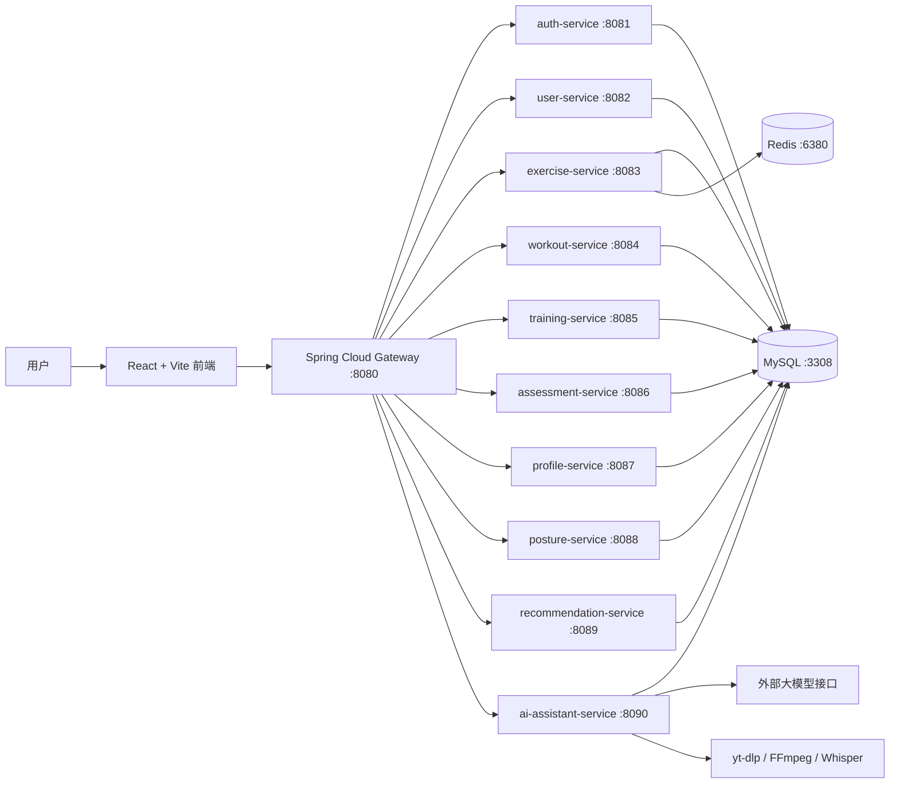

# SomaticBuilding 中文说明

[English README](README.md)

SomaticBuilding 是一个 AI 辅助的身体功能训练与动作评估系统，围绕“动作库、体态评估、身体功能评估、训练编排、训练执行、训练总结、运动员画像、AI 教练、短视频解析生成训练计划”等核心场景，构建了 React 前端 + Spring Boot 微服务后端 + MySQL/Redis 数据层的一体化工程项目。

本项目不是单纯页面原型，而是逐步完成了前后端接口联通、数据库表设计、真实训练数据记录、AI 结构化训练方案生成、RAG 知识问答、短视频内容解析、动作自动补全、测试与压测报告等工程内容，适合作为软件工程毕业设计项目展示。

## 1. 项目定位

SomaticBuilding 面向需要进行身体功能训练、动作学习、训练计划编排和能力追踪的用户。系统希望解决三个问题：

1. 用户不知道自己当前身体功能状态如何。
2. 用户不知道应该如何把动作组合成科学训练课或训练模块。
3. 用户看到短视频平台上的训练内容后，难以结构化复用为自己的训练计划。

因此项目设计了从“评估 -> 画像 -> 动作库 -> 训练编排 -> 训练执行 -> 总结反馈 -> AI 辅助优化”的完整闭环。

## 2. 核心功能概览

- 用户登录注册：支持系统入口登录、注册、昵称设置和基础用户信息同步。
- 系统评估流程：包含生活方式、伤病史、运动经历、训练目标、FMS/动作评估等流程。
- 动作库系统：支持按照训练系统/风格进入动作库，查看动作详情、图片、视频、目标肌群、步骤和注意事项。
- 自定义动作：支持用户新增动作，并上传本地图片或视频资源。
- 训练模块 Module：用于快速训练、关节灵活性、稳定性、激活、拉伸放松等短训练单元。
- 训练课 Course：用于完整单节训练课，包含不同训练风格对应的 block、动作组、组数、次数、休息和训练方式。
- 周计划 Program：以 Day 1、Day 2 等方式安排一周训练模板，启动后再绑定真实日期。
- 训练执行 Player：将训练计划和实际执行分离，记录真实 set、timer、exercise log。
- 训练总结 Summary：基于真实训练执行记录统计，而不是只读取计划推算。
- Athlete Profile：展示用户能力趋势、训练记录、推荐、目标画像和可视化数据。
- Posture 体态模块：展示身体关节风险点、关节对应扫描图、体态/关节状态信息。
- AI Plan：根据自然语言需求生成训练 module 或 course，并以可视化方案卡片呈现。
- AI Q&A：使用 RAG 知识检索回答训练相关问题，与训练编排入口分离。
- 短视频解析：根据 B 站、小红书、抖音等外部链接解析字幕、音频、画面帧，并尝试生成对应训练内容。
- 分享能力：支持用户分享自己创建的 module/course，生成 Base62 短链接。
- 性能优化：包含 SQL 索引、Redis 热点缓存、批量查询优化和 k6 压测报告。
- 自动化测试：包含前端 Vitest、后端 JUnit/Mockito/MockMvc 单元测试和集成测试。

## 3. 主要用户流程

### 3.1 系统入口与评估流程

1. 用户进入 `/system`。
2. 用户登录或注册。
3. 系统提示注册成功或登录成功。
4. 用户填写基础信息、运动经历、伤病史、训练目标、器械条件等。
5. 系统调用目标分析接口，生成简短分析结果和目标画像。
6. 用户进入动作/功能评估流程。
7. 评估结果写入后端并在 Profile 中展示。
8. 系统根据用户状态推荐后续训练方向。

相关前端路由：

- `/system`
- `/system/login`
- `/system/onboarding`
- `/system/goals`
- `/system/assessment`
- `/system/assessment-list`
- `/system/assessment-active`
- `/system/profile`
- `/system/history`
- `/system/summary`

### 3.2 动作库流程

1. 用户从 AppShell 进入动作库时，默认先进入 `/systems`。
2. 用户选择对应训练系统或风格。
3. 系统进入 `/library/:systemId` 并只展示对应风格动作。
4. 用户可以查看动作详情，包括能力画像、目标肌群、执行步骤、注意事项、图片和视频。
5. 用户可以把动作加入训练编排，或创建自定义动作。

相关前端路由：

- `/systems`
- `/library`
- `/library/:systemId`
- `/exercise/:id`

### 3.3 训练模块、训练课与计划

项目将训练内容拆分为三个层级：

| 层级 | 含义 | 典型场景 |
|---|---|---|
| Module | 快速训练模块 | 踝关节稳定、髋灵活性、肩胛激活、拉伸放松 |
| Course | 单节完整训练课 | 上肢力量课、爆发力训练课、有氧燃脂课、功能性训练课 |
| Program | 一周训练计划模板 | Day 1 力量，Day 2 灵活性，Day 3 有氧，Day 4 恢复 |

训练计划中不直接写死具体日期，而是先使用 Day 1、Day 2 等相对天数。用户真正开始计划后，再根据开始日期映射到真实日历。

相关前端路由：

- `/training`
- `/modules`
- `/module/:id`
- `/workout-style`
- `/workout-builder`
- `/templates`
- `/programs`
- `/share/template/:shareCode`
- `/s/:shareCode`

### 3.4 训练执行与总结

1. 用户从 module、course 或 program 进入训练。
2. 训练播放器展示当前动作、下一动作、计时、组数和休息逻辑。
3. 用户真实执行时产生训练 run、set log、timer log、exercise log。
4. 训练总结基于真实执行记录统计总次数、总重量、训练时长、动作完成情况等。
5. 训练记录进入 TrainingHub、Recent Log、Weekly Snapshot 和 Athlete Profile。

相关前端路由：

- `/workout`
- `/workout-summary`
- `/athlete`

### 3.5 体态与关节功能模块

体态模块用于展示身体关节风险点、关节状态和对应扫描图片。系统针对不同关节配置不同的图像资源，避免所有关节都复用同一张图。

相关前端路由：

- `/posture`

## 4. AI 能力设计

### 4.1 Plan 入口：训练编排

Plan 入口用于生成训练方案，不用于普通问答。系统会根据用户自然语言判断训练意图，例如：

- “我想要上肢力量训练” -> 力量训练课。
- “我想让肌肉更好看” -> 健美/增肌风格训练。
- “我想提高脚踝稳定性” -> 功能性/稳定性训练模块。
- “我想有氧燃脂” -> 有氧或 HIIT 风格训练。

Plan 入口的设计要求：

- 先确认用户需要完整训练课还是快速训练模块。
- 如果条件不足，询问器械、场地、时长、训练经验等。
- 如果用户选择训练课，需要按训练风格补齐完整 block。
- 如果用户选择快速 module，不应跳入训练课 builder，也不应把所有动作塞进第一个 block。
- 输出应使用可视化方案卡片，而不是纯 Markdown 文本。
- 自然语言生成训练时可以给 A/B/C 三个不同方案。
- 外部链接解析时应尽量复现视频内容，一般只生成一个与视频对应的计划。
- 用户可以继续对方案进行微调，例如替换动作、调整轮数、修改休息时间。

当前实现采用稳定的结构化 JSON 协议来模拟 function calling 风格的数据联动，前端根据 payload 渲染可视化卡片、按钮和方案预览。

关键文件：

- `backend/ai-assistant-service/src/main/java/com/somaticbuilding/aiassistant/application/AiAssistantService.java`
- `backend/ai-assistant-service/src/main/java/com/somaticbuilding/aiassistant/application/ExerciseAutoProvisionService.java`
- `src/shared/api/assistant.ts`
- `src/shared/components/AppShell.tsx`

### 4.2 Q&A 入口：RAG 知识问答

Q&A 入口用于回答训练知识问题，不应该和训练计划生成混在一起。它通过本地 RAG 知识库检索相关内容，并将参考片段注入模型提示词。

当前 RAG 能力：

- 从 `rag-kb` 加载本地 Markdown 知识库。
- 支持未来扩展外部 `knowledge-base` 目录。
- 对知识内容分块、检索、排序。
- 将相关上下文注入回答。
- 模型不可用时可返回 fallback 回答。

关键文件：

- `backend/ai-assistant-service/src/main/java/com/somaticbuilding/aiassistant/application/RagKnowledgeService.java`
- `backend/ai-assistant-service/src/main/resources/rag-kb/`

### 4.3 短视频链接解析

短视频解析功能用于将外部平台训练视频转成结构化训练内容。它和普通自然语言生成训练不同：

- 自然语言生成：根据用户需求生成多个候选训练方案。
- 链接解析生成：应尽量还原视频里的训练内容，一般不应随意生成三个无关方案。

当前设计流程：

1. 用户提交外部视频链接。
2. 后端创建 content analysis job。
3. 使用 `yt-dlp` 获取视频元数据、字幕或下载可分析内容。
4. 没有字幕时尝试音频提取和 ASR。
5. 使用 FFmpeg/FFprobe 抽取关键帧。
6. 可选调用视觉模型分析动作画面。
7. 提取 movement candidates。
8. 如果动作库找不到对应动作，调用动作新增接口进行自动补全。
9. 用户可以查看候选动作并确认。
10. 系统生成与视频内容对应的训练计划草案。

关键文件：

- `backend/ai-assistant-service/src/main/java/com/somaticbuilding/aiassistant/application/ContentAnalysisService.java`
- `backend/ai-assistant-service/src/main/java/com/somaticbuilding/aiassistant/application/VideoLinkAutoExtractor.java`
- `backend/ai-assistant-service/src/main/java/com/somaticbuilding/aiassistant/application/VideoFrameExtractionService.java`
- `backend/ai-assistant-service/src/main/java/com/somaticbuilding/aiassistant/application/VideoVisualAnalysisService.java`
- `backend/ai-assistant-service/src/main/java/com/somaticbuilding/aiassistant/interfaces/ContentAnalysisController.java`

## 5. 系统架构



## 6. 技术栈

### 6.1 前端

- React 18
- TypeScript / TSX
- Vite 6
- React Router
- Tailwind CSS
- Radix UI 组件原语
- Material UI 图标和部分组件
- Three.js / React Three Fiber / Drei
- D3 / Recharts 数据可视化
- React DnD 拖拽交互
- Vitest 单元测试

### 6.2 后端

- Java 17
- Spring Boot 3.2
- Spring Cloud 2023
- Spring Cloud Gateway
- Spring Cloud Alibaba 依赖体系
- MyBatis-Plus
- MySQL
- Redis
- Spring AI 风格集成
- JUnit 5 / Mockito / MockMvc 自动化测试

### 6.3 AI 与媒体处理

- OpenAI-compatible 模型接口
- DeepSeek-compatible 模型接口
- DashScope-compatible 模型接口
- yt-dlp
- FFmpeg / FFprobe
- Docker 模式 Whisper ASR

### 6.4 工程质量

- Git LFS 管理大型 3D 模型和媒体资源。
- k6 核心链路压测。
- Redis 热点缓存优化。
- SQL 索引优化。
- 前端单元测试和后端单元/集成测试。

## 7. 后端服务划分

| 服务 | 端口 | 职责 |
|---|---:|---|
| gateway-service | 8080 | API 网关和路由聚合 |
| auth-service | 8081 | 登录、注册、OAuth 相关认证流程 |
| user-service | 8082 | 用户账号和个人信息 |
| exercise-service | 8083 | 动作库、动作媒体、筛选、缓存 |
| workout-service | 8084 | Module/Course/Program/Template 编排接口 |
| training-service | 8085 | 训练执行、训练日志、历史和总结 |
| assessment-service | 8086 | 功能评估会话和结果 |
| profile-service | 8087 | 能力画像和运动员数据聚合 |
| posture-service | 8088 | 体态快照和关节状态数据 |
| recommendation-service | 8089 | TrainingHub/Profile 推荐数据 |
| ai-assistant-service | 8090 | AI 训练编排、RAG 问答、目标分析、短视频解析 |

## 8. 项目目录结构

```text
D:/somaticBuilding
├── backend/                         # Spring Boot/Spring Cloud 后端服务
│   ├── gateway-service/
│   ├── auth-service/
│   ├── user-service/
│   ├── assessment-service/
│   ├── posture-service/
│   ├── exercise-service/
│   ├── workout-service/
│   ├── training-service/
│   ├── profile-service/
│   ├── recommendation-service/
│   ├── ai-assistant-service/
│   └── common-lib/
├── src/                             # React 前端源码
│   ├── app/                         # 应用入口和路由
│   ├── modules/                     # home/library/training/profile/system/posture 等业务模块
│   ├── shared/                      # API 客户端、公共组件、公共数据和工具函数
│   └── styles/                      # 全局样式和主题
├── public/                          # 静态资源、体态模型、动作/体态图片等
├── scripts/                         # 数据导入、媒体回填、性能测试脚本
├── docs/                            # API、架构、数据库、PRD、测试、压测文档
├── guidelines/                      # 项目规范
├── package.json                     # 前端脚本和根测试命令
├── pnpm-lock.yaml                   # 依赖锁定文件
├── README.md                        # 英文 README
└── README.zh-CN.md                  # 中文 README
```

## 9. 数据库脚本

数据库设计和初始化脚本位于 `docs/database`。

| 文件 | 作用 |
|---|---|
| `docs/database/DB-INIT.sql` | 主要数据库初始化脚本 |
| `docs/database/DB-DDL-DRAFT.sql` | 核心表结构 DDL 草案 |
| `docs/database/DB-DDL-CONTENT-ANALYSIS.sql` | 短视频解析/content analysis 相关表 |
| `docs/database/migrations/2026-05-09-exercise-performance-indexes.sql` | 动作列表性能索引优化 |

本地默认数据库配置：

```text
MySQL host: localhost
MySQL port: 3308
Database: somaticbuilding_db
User: root
Password: ${MYSQL_PASSWORD:123456}

Redis host: localhost
Redis port: 6380
Password: ${REDIS_PASSWORD:123456}
```

## 10. 环境变量和密钥管理

项目提供了安全示例文件：

```text
.env.example
```

主要变量：

```bash
MYSQL_HOST=127.0.0.1
MYSQL_PORT=3308
MYSQL_USER=root
MYSQL_PASSWORD=123456
MYSQL_DATABASE=somaticbuilding_db

REDIS_HOST=127.0.0.1
REDIS_PORT=6380
REDIS_PASSWORD=123456

OPENAI_API_KEY=
DEEPSEEK_API_KEY=

FFMPEG_COMMAND=ffmpeg
AUTO_VIDEO_DURATION_SEC=8
```

真实 AI Key 不应提交到 GitHub。推荐使用系统环境变量，或使用本地私有配置文件：

```text
backend/ai-assistant-service/src/main/resources/application-local-private.yml
```

示例：

```yaml
spring:
  ai:
    openai:
      api-key: your-openai-compatible-key
    deepseek:
      api-key: your-deepseek-key
```

该文件被 `.gitignore` 忽略，不会被上传到 GitHub，但本地启动 `ai-assistant-service` 时会自动读取。

## 11. 本地运行

### 11.1 环境要求

- Node.js 18+
- pnpm 或 npm
- Java 17
- Maven 3.8+
- MySQL，端口 `3308`
- Redis，端口 `6380`
- Git LFS
- 可选：Docker、yt-dlp、FFmpeg、FFprobe，用于短视频解析

### 11.2 安装前端依赖

```bash
corepack enable
pnpm install
```

或使用 npm：

```bash
npm install
```

### 11.3 初始化数据库

先创建数据库，再执行 `docs/database` 下的 SQL 文件。主要初始化脚本：

```bash
docs/database/DB-INIT.sql
```

根据功能需要继续执行：

```bash
docs/database/DB-DDL-DRAFT.sql
docs/database/DB-DDL-CONTENT-ANALYSIS.sql
docs/database/migrations/2026-05-09-exercise-performance-indexes.sql
```

### 11.4 启动后端服务

进入后端目录：

```bash
cd backend
mvn clean install -DskipTests
```

按需启动服务。典型本地启动顺序：

```bash
mvn -pl gateway-service spring-boot:run
mvn -pl auth-service spring-boot:run
mvn -pl user-service spring-boot:run
mvn -pl exercise-service spring-boot:run
mvn -pl workout-service spring-boot:run
mvn -pl training-service spring-boot:run
mvn -pl assessment-service spring-boot:run
mvn -pl profile-service spring-boot:run
mvn -pl posture-service spring-boot:run
mvn -pl recommendation-service spring-boot:run
mvn -pl ai-assistant-service spring-boot:run
```

开发时不一定要启动所有服务，只需要启动当前页面依赖的服务即可。正常前端联调一般至少需要 gateway 和对应业务服务。

### 11.5 启动前端

在项目根目录执行：

```bash
npm run dev
```

默认访问地址：

```text
http://localhost:5173
```

## 12. 数据导入和媒体脚本

`scripts` 目录包含动作导入、媒体回填和性能测试相关脚本。

| 脚本 | 作用 |
|---|---|
| `scripts/import-open-exercises.mjs` | 导入开源动作数据到本地数据文件 |
| `scripts/sync-open-exercises-to-mysql.mjs` | 将动作数据同步到 MySQL |
| `scripts/backfill-exercise-cover-images.mjs` | 回填动作静态封面图 |
| `scripts/backfill-exercise-covers-from-video.mjs` | 从视频源提取封面帧 |
| `scripts/backfill-exercise-videos.mjs` | 回填动作视频资源 |
| `scripts/migrate-exercise-videos-to-remote.mjs` | 将本地生成视频迁移为远程 GIF/视频源 |
| `scripts/perf/exercise_list_load.js` | k6 动作列表压测脚本 |

## 13. 测试与验证

### 13.1 前端单元测试

```bash
npm run test:frontend
```

### 13.2 后端单元测试和集成测试

```bash
npm run test:backend
```

等价命令：

```bash
cd backend
mvn -pl ai-assistant-service,training-service -am test
```

### 13.3 一键测试

```bash
npm run test
```

### 13.4 生产构建

```bash
npm run build
```

测试报告位置：

```text
docs/testing/test-report-2026-05-29.md
```

## 14. 性能压测与优化证据

项目包含 k6 压测脚本和性能报告，用于证明核心链路具备一定工程优化能力。

关键报告：

- `docs/performance/reports/2026-05-09-exercise-core-chain-loadtest.md`
- `docs/performance/reports/2026-05-09-gateway-cache-loadtest.md`
- `docs/performance/reports/exercise_list_comparison.md`
- `docs/performance/reports/gateway_exercise_list_cache_comparison.md`

已完成的优化示例：

- 动作列表 SQL 索引优化。
- 动作媒体批量查询，降低 N+1 查询风险。
- 动作列表 Redis 热点缓存。
- exercise-service 接入 Micrometer/Prometheus 指标。
- 对 20/50/100 并发场景进行压测，并记录优化前后对比。

## 15. 重要文档

- `docs/api/API-SPEC.md`
- `docs/api/API-MODULES.md`
- `docs/architecture/BACKEND-ARCHITECTURE.md`
- `docs/architecture/BACKEND-PRD.md`
- `docs/architecture/VIDEO-LINK-TRAINING-BLUEPRINT.md`
- `docs/database/DB-DESIGN-SPEC.md`
- `docs/prd/PRD-Status.md`
- `docs/prd/E2E-REGRESSION-CHECKLIST.md`
- `docs/ai-rag-function-calling.md`

## 16. 当前工程范围

当前仓库包含：

- 前端应用源码。
- 后端微服务源码。
- 数据库表结构和迁移脚本。
- 动作数据和静态媒体资源。
- AI/RAG/短视频解析相关实现。
- 自动化测试和性能测试文档。
- Git LFS 管理的大型模型和媒体资源。

仍可继续扩展的方向：

- 完整云部署和服务治理。
- 更正式的原生 function calling schema。
- 向量数据库版 RAG。
- 更完善的媒体对象存储。
- 更多端到端测试和 Testcontainers 数据库集成测试。
- 更完整的移动端适配和真实用户训练数据分析。

## 17. 安全说明

- 不要将真实 API Key 或私有凭据提交到 GitHub。
- 本地 AI Key 使用环境变量或 `application-local-private.yml`。
- `.env` 和私有配置文件已被 `.gitignore` 忽略。
- 运行日志、构建产物、缓存和临时视频分析帧不会上传。
- 大型 3D 模型和媒体资源通过 Git LFS 管理。