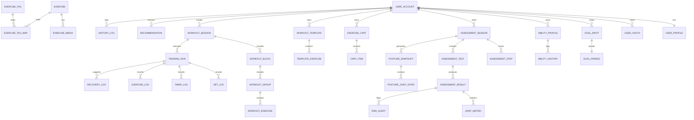

# SomaticBuilding / Physical OS - ER 关系图（数据库总览）

更新时间：2026-04-06（Asia/Shanghai）

```mermaid
erDiagram
    USER_ACCOUNT ||--|| USER_PROFILE : has
    USER_ACCOUNT ||--o{ USER_OAUTH : binds

    USER_ACCOUNT ||--o{ GOAL_INPUT : writes
    GOAL_INPUT ||--|| GOAL_PARSED : parsed

    USER_ACCOUNT ||--o{ ABILITY_PROFILE : owns
    ABILITY_PROFILE ||--o{ ABILITY_HISTORY : logs

    USER_ACCOUNT ||--o{ ASSESSMENT_SESSION : starts
    ASSESSMENT_SESSION ||--o{ ASSESSMENT_STEP : tracks
    ASSESSMENT_SESSION ||--o{ ASSESSMENT_TEST : includes
    ASSESSMENT_TEST ||--o{ ASSESSMENT_RESULT : produces
    ASSESSMENT_RESULT ||--o{ JOINT_METRIC : contains
    ASSESSMENT_RESULT ||--o{ RISK_ALERT : flags
    ASSESSMENT_SESSION ||--o{ POSTURE_SNAPSHOT : generates
    POSTURE_SNAPSHOT ||--o{ POSTURE_JOINT_STATE : contains

    EXERCISE ||--o{ EXERCISE_MEDIA : has
    EXERCISE ||--o{ EXERCISE_TAG_MAP : maps
    EXERCISE_TAG ||--o{ EXERCISE_TAG_MAP : maps

    USER_ACCOUNT ||--o{ EXERCISE_CART : owns
    EXERCISE_CART ||--o{ CART_ITEM : contains

    USER_ACCOUNT ||--o{ WORKOUT_TEMPLATE : owns
    WORKOUT_TEMPLATE ||--o{ TEMPLATE_EXERCISE : contains

    USER_ACCOUNT ||--o{ WORKOUT_SESSION : creates
    WORKOUT_SESSION ||--o{ WORKOUT_BLOCK : includes
    WORKOUT_BLOCK ||--o{ WORKOUT_GROUP : includes
    WORKOUT_GROUP ||--o{ WORKOUT_EXERCISE : includes

    WORKOUT_SESSION ||--o{ TRAINING_RUN : executes
    TRAINING_RUN ||--o{ SET_LOG : records
    TRAINING_RUN ||--o{ TIMER_LOG : records
    TRAINING_RUN ||--o{ EXERCISE_LOG : records
    TRAINING_RUN ||--o{ RECOVERY_LOG : suggests

    USER_ACCOUNT ||--o{ RECOMMENDATION : receives
    USER_ACCOUNT ||--o{ HISTORY_LOG : logs
```
