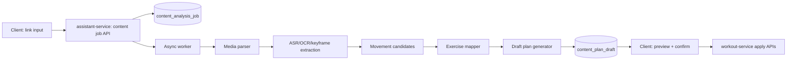

# Video Link -> Training Plan Implementation Blueprint

Last updated: 2026-05-04 (Asia/Shanghai)
Owner: AI + Training Platform

## Implementation Update (2026-05-02)
- `ai-assistant-service` now supports backend-side auto extraction before candidate generation:
  - tries `yt-dlp` metadata extraction (title/description/uploader/tags/duration),
  - tries `yt-dlp` subtitle download (`write-subs` + `write-auto-subs`) and converts to plain text,
  - can optionally run local ASR fallback (download audio + transcribe) when subtitle is unavailable,
  - falls back to HTML meta scraping when metadata is missing.
- Extracted text is persisted into `content_analysis_asset` with `storage_provider = auto_extractor` and reused in `startAnalyze`.
- `POST /api/v1/assistant/content/jobs` now defaults to `status = queued` (no manual upload required for the first analysis attempt).
- Manual material upload endpoint remains as fallback for links that cannot be auto parsed due platform/network/compliance constraints.
- ASR is configurable and disabled by default in `application.yml`:
  - `integration.content-extractor.asr.enabled`
  - `integration.content-extractor.asr.command` (e.g. `whisper`)
  - `integration.content-extractor.asr.model` / `language` / `timeout-seconds`

## Implementation Update (2026-05-03)
- Added optional backend ASR fallback pipeline in `VideoLinkAutoExtractor`:
  - download best audio with `yt-dlp`,
  - normalize to mono 16k WAV via `ffmpeg`,
  - transcribe with configurable CLI (default command key: `whisper`),
  - reuse transcript text in the same analysis flow.
- Added ASR runtime mode switch:
  - `integration.content-extractor.asr.mode=local|docker`
  - docker mode keys: `integration.content-extractor.asr.docker.command/image/pull-missing`
- In docker mode, backend runs Whisper inside container with `/data` volume mount and can auto-pull image when missing.
- ASR fallback triggers only when subtitle extraction is empty and `integration.content-extractor.asr.enabled=true`.
- If ASR command/docker runtime fails, analysis does not crash; extractor records warning and continues with available metadata/text.
- Validation on 2026-05-03:
  - backend compile passed (`mvn -pl ai-assistant-service -am -DskipTests compile`),
  - content pipeline smoke test passed (`jobId=5`, `pipelineStatus=awaiting_candidate_review`, `materialCount=1`, `candidateCount=5`),
  - Docker image pre-pull can be flaky under current network (observed TLS handshake timeout), but failure path is warning-only and does not break analysis lifecycle.

## 1. Goal
Enable users to submit mainstream platform video links (Bilibili / Douyin / Xiaohongshu) and generate:
- Quick training module, or
- Full training course
based on recognized movement content + user constraints.

## 2. Reality Check (Important)
This feature has two separate technical problems:
1. Content understanding: parse movement/video information from a link.
2. Program generation: convert parsed content into structured module/course.

The second part already has foundation in current project (assistant + workout APIs).
The first part is the difficult part and should be built progressively.

## 3. Current Baseline in This Repo
Existing relevant capabilities:
- Assistant APIs in `ai-assistant-service`:
  - `POST /api/v1/assistant/session`
  - `POST /api/v1/assistant/chat`
  - `POST /api/v1/assistant/goal-synthesis`
- Workout composition APIs in `workout-service` and FE adapter:
  - `/api/v1/workout/session`
  - `/api/v1/workout/group`
  - `/api/v1/workout/exercise`
  - template CRUD/list/apply flow
- Frontend already supports plan preview + apply path in assistant panel and builder pages.

Conclusion:
- We should reuse `ai-assistant-service` as the orchestration entry.
- We should avoid over-coupling with platform-specific scraping in V1.

## 4. Delivery Phases

## Phase P1 (MVP, recommended first release)
Target: Launch a usable flow with minimal compliance risk.

User flow:
1. User submits a platform link.
2. System parses platform + video id.
3. If direct analyzable media is unavailable, ask user to provide one of:
   - Video file upload, or
   - Subtitle/text description, or
   - 3-8 keyframe screenshots.
4. System runs async analysis and returns recognized movement candidates.
5. User confirms/edits candidates.
6. System generates 2-3 plan options (module/course), preview first, then apply.

Value:
- Works now.
- Avoids brittle dependence on unofficial crawling.
- Keeps user in control with review gate.

## Phase P2 (Authorized platform enhancement)
Target: reduce manual upload frequency.

- Add platform OAuth where available.
- Fetch metadata/caption via official APIs when permission allows.
- Keep fallback to upload/summary mode.

## Phase P3 (Advanced automation)
Target: "paste link -> mostly automatic professional plan".

- Better multimodal parsing (ASR + OCR + action segmentation).
- Better exercise mapping confidence and style inference.
- Conversational plan editing that updates structured plan directly.

## 5. Proposed Architecture (P1)



Service split (P1):
- Keep all orchestration endpoints in `ai-assistant-service`.
- Add internal worker module in same service first (faster delivery).
- Split into standalone `media-analysis-service` only when load increases.

## 6. Data Model (P1)

## 6.1 `content_analysis_job`
Purpose: job lifecycle and request metadata.

Suggested fields:
- `id` BIGINT PK
- `user_id` BIGINT
- `source_platform` VARCHAR(32) (`bilibili`/`douyin`/`xiaohongshu`/`unknown`)
- `source_url` VARCHAR(1024)
- `source_video_id` VARCHAR(128)
- `analysis_mode` VARCHAR(32) (`url_only`/`upload_video`/`upload_frames`/`manual_text`)
- `goal_type` VARCHAR(16) (`module`/`course`)
- `status` VARCHAR(32)
- `error_code` VARCHAR(64)
- `error_message` VARCHAR(512)
- `confidence_score` DECIMAL(5,2)
- `create_time` DATETIME(3)
- `update_time` DATETIME(3)
- `is_deleted` TINYINT

Status enum:
- `created`
- `waiting_user_material`
- `queued`
- `processing`
- `awaiting_candidate_review`
- `awaiting_plan_confirm`
- `applied`
- `failed`
- `cancelled`

## 6.2 `content_analysis_asset`
Purpose: track uploaded or derived assets.

Fields:
- `id`, `job_id`
- `asset_type` (`video`/`frame`/`subtitle`/`manual_note`)
- `storage_key`
- `duration_sec`
- `metadata_json`
- timestamps + `is_deleted`

## 6.3 `content_movement_candidate`
Purpose: recognized movement candidates before mapping confirmation.

Fields:
- `id`, `job_id`
- `raw_label` VARCHAR(128)
- `normalized_label` VARCHAR(128)
- `start_sec`, `end_sec` DECIMAL(8,2)
- `confidence` DECIMAL(5,2)
- `notes` VARCHAR(255)
- `review_state` (`pending`/`accepted`/`rejected`/`edited`)
- timestamps + `is_deleted`

## 6.4 `content_exercise_mapping`
Purpose: map recognized movement to existing exercise library ids.

Fields:
- `id`, `job_id`, `candidate_id`
- `exercise_id`
- `match_score` DECIMAL(5,2)
- `mapping_source` (`rule`/`embedding`/`manual`)
- `final_selected` TINYINT
- timestamps + `is_deleted`

## 6.5 `content_plan_draft`
Purpose: generated plan options before user confirmation.

Fields:
- `id`, `job_id`
- `plan_type` (`module`/`course`)
- `option_index` INT
- `style` VARCHAR(32)
- `title` VARCHAR(128)
- `summary` VARCHAR(512)
- `structure_json` JSON
- `status` (`draft`/`confirmed`/`discarded`)
- timestamps + `is_deleted`

## 7. API Contract (P1)
Prefix: `/api/v1/assistant/content`

## 7.1 Create job
`POST /jobs`

Request:
```json
{
  "user_id": 1,
  "source_url": "https://www.bilibili.com/video/BV...",
  "goal_type": "course",
  "user_constraints": {
    "equipment": ["dumbbell", "bodyweight"],
    "location": "gym",
    "duration_min": 45,
    "injury_notes": "knee history"
  }
}
```

Response:
```json
{
  "code": 0,
  "data": {
    "job_id": 90001,
    "status": "waiting_user_material",
    "required_material": ["upload_video_or_frames_or_subtitle"]
  }
}
```

## 7.2 Upload/add materials
`POST /jobs/{job_id}/materials`

Supports:
- uploaded video key
- frame image keys
- subtitle text
- manual summary text

## 7.3 Start analysis
`POST /jobs/{job_id}/analyze`

- enqueue async task
- return current status

## 7.4 Query job detail
`GET /jobs/{job_id}`

Returns:
- status
- parsed metadata
- confidence
- candidate summary
- error if failed

## 7.5 Candidate review
`GET /jobs/{job_id}/candidates`
`POST /jobs/{job_id}/candidates/review`

Review request example:
```json
{
  "updates": [
    { "candidate_id": 1, "action": "accept", "mapped_exercise_id": 874 },
    { "candidate_id": 2, "action": "replace", "mapped_exercise_id": 512 }
  ]
}
```

## 7.6 Generate plan options
`POST /jobs/{job_id}/plans/generate`

Request:
```json
{
  "plan_type": "course",
  "options": 3,
  "style_hint": "auto"
}
```

## 7.7 Preview plan options
`GET /jobs/{job_id}/plans`

## 7.8 Apply selected plan
`POST /jobs/{job_id}/plans/{plan_id}/apply`

Request:
```json
{
  "apply_target": "workout_builder",
  "save_template": true
}
```

Response includes created `session_id` or `template_id`.

## 8. Plan Structure Contract (for function-calling)
The AI should return strict JSON (no markdown) with full training structure.

Core schema:
```json
{
  "plan_type": "course",
  "style": "functional",
  "title": "Ankle Stability & Lower-body Control",
  "duration_min": 45,
  "blocks": [
    {
      "block_name": "Warmup",
      "goal": "mobility + activation",
      "groups": [
        {
          "group_type": "circuit",
          "rounds": 2,
          "exercises": [
            {
              "exercise_id": 874,
              "sets": 2,
              "reps": 12,
              "rest_seconds": 30,
              "time_seconds": 0,
              "tempo": "controlled"
            }
          ]
        }
      ]
    }
  ],
  "progression": "2-week load progression",
  "safety_notes": ["keep pain <= 3/10"]
}
```

Rules:
- `course` must contain complete block sequence for its inferred style.
- `module` can be compact, but still includes clear intensity and rest.
- No unknown exercise ids when applying; unresolved items must be flagged before apply.

## 9. Style Inference + Block Templates
Inference priority:
1. User explicit intent text.
2. Video content cues.
3. Candidate movement pattern distribution.

Examples:
- Aesthetic/hypertrophy intent -> bodybuilding style blocks.
- Joint stability / rehab intent -> functional or rehab blocks.
- Fat loss / cardio intent -> conditioning blocks.

Important constraint:
- For each style, block set must be complete for that style definition.
- Do not force Warmup/Cooldown for styles where your domain template defines different structure.

## 10. Compliance / Legal / Risk Boundary
- Do not rely on unofficial scraping as primary production path.
- Respect platform terms and user authorization boundaries.
- Persist only necessary metadata; avoid long-term storage of copyrighted raw media when not required.
- Keep user-visible confidence + manual review gate before plan apply.
- Add delete endpoint for user-provided media/material.

## 11. Platform Integration Notes (current public docs)
- Douyin open platform supports developer integration but depends on app onboarding and permissions.
- Xiaohongshu open platform docs are Ark-oriented (merchant/system integration), not a guaranteed generic public-video ingestion API.
- Bilibili miniapp docs describe miniapp APIs and are not equal to unrestricted server-side public video extraction permission.

So for production stability: P1 should be "link + user-supplied analyzable material" first.

## 12. MVP Engineering Plan (2 iterations)

Iteration 1 (backend first):
- Add `content job` tables + mapper/domain.
- Add job/material/candidate/plan APIs in `ai-assistant-service`.
- Add async worker stub + manual-text analysis path.
- Return structured plan options and apply into workout session/template.

Iteration 2 (frontend + workflow hardening):
- Add "Video to Plan" panel in assistant.
- Add job status polling UI.
- Add candidate review UI.
- Add plan preview -> apply flow with explicit confirm.
- Add fallback and error handling UX.

## 13. Acceptance Criteria (P1)
- User can submit one link and complete one end-to-end flow to a usable module/course.
- At least one analysis path works without platform-specific API (manual text/frame upload path).
- Generated plan can be previewed before apply.
- Apply writes valid workout data via existing workout APIs.
- Failed job has readable error + recover path.

## 14. Open Decisions (to finalize before coding)
1. Storage strategy for uploaded media (local vs object storage).
2. Retention policy for uploaded content and derived artifacts.
3. Minimum confidence threshold for auto-accept mapping.
4. Whether to allow direct apply or always force candidate review first.

## 15. References
- Douyin Open Platform (resource docs):
  - https://open.douyin.com/platform/resource/docs/accession-guide/platform-accession
  - https://open.douyin.com/platform/resource/docs/ability/open-data/video-data-solution
  - https://open.douyin.com/platform/resource/docs/ability/content-management/douyin-publish-solution/
- Xiaohongshu Open Platform (Ark):
  - https://school.xiaohongshu.com/en/open/quick-start/introduction.html
  - https://school.xiaohongshu.com/en/open/quick-start/system-parameter.html
- Bilibili Miniapp API overview:
  - https://miniapp.bilibili.com/miniprogram-docs/api/api-overview

## 16. Implementation Status (2026-05-02)
Delivered in backend `ai-assistant-service`:

- Data layer
  - Added domain + mapper for:
    - `content_analysis_job`
    - `content_analysis_asset`
    - `content_movement_candidate`
    - `content_exercise_mapping`
    - `content_plan_draft`
  - Added lightweight `exercise` mapper/domain for candidate -> exercise mapping lookup.

- API layer
  - Added controller prefix: `/api/v1/assistant/content`
  - Implemented endpoints:
    - `POST /jobs`
    - `POST /jobs/{jobId}/materials`
    - `POST /jobs/{jobId}/analyze`
    - `GET /jobs/{jobId}`
    - `GET /jobs/{jobId}/candidates`
    - `POST /jobs/{jobId}/candidates/review`
    - `POST /jobs/{jobId}/plans/generate`
    - `GET /jobs/{jobId}/plans`
    - `POST /jobs/{jobId}/plans/{planId}/apply`

- Pipeline behavior (MVP stub + apply integration)
  - `analyze` performs deterministic keyword-based candidate extraction.
  - Candidates are mapped to existing exercise library ids.
  - Plan generation returns structured JSON options (`course`/`module`) with style-based block templates.
  - Candidate review supports accept/reject/replace/edit and manual mapped exercise override.
  - Apply endpoint now writes structured plan into workout-service:
    - create `session`
    - create `group` per block
    - create `exercise` rows per group
    - optional `template` save when `save_template=true`

- Build/config
  - Updated `ai-assistant-service` dependencies for validation, MyBatis-Plus, MySQL, common-core, and Spring AI.
  - Added Spring milestone repository in backend parent `pom.xml` for milestone artifacts.
  - Module-level compile verification passed.

## Implementation Update (2026-05-04)
- Upgraded content-analysis output from plain preview to structured insight in `analysis_result_json`:
  - `style_hint`, `content_type`, `plan_type_hint`
  - `focus_terms`, `equipment_hints`, `risk_flags`
  - `segment_clues`, `summary`, `text_preview`
- Candidate generation now uses structured insight + style fallback seeds (instead of pure keyword-only fallback), reducing brittle behavior when subtitle text is sparse.
- `result_summary` is now generated from structured insight and candidate count, making job status text more informative for frontend.
- `GET /api/v1/assistant/content/jobs/{jobId}` now returns `analysis_result_json` in response payload (`ContentJobResponse`).
- Style inference in plan generation now first checks structured analysis JSON, then falls back to legacy keyword scan.
- Environment housekeeping: duplicate C-drive project copy was cleaned; active development path remains `D:\somaticBuilding`.